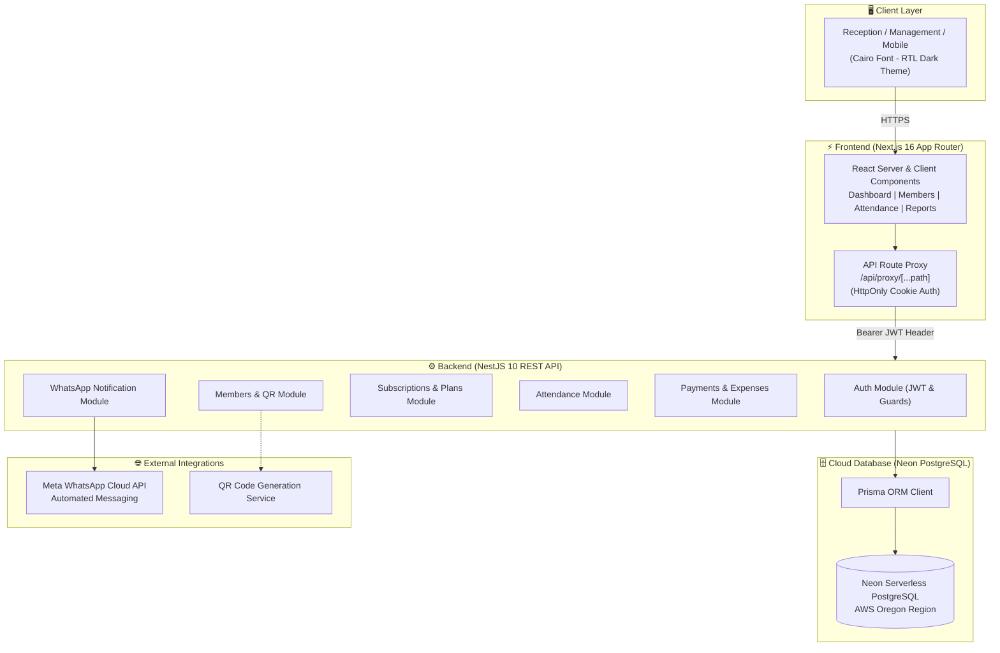
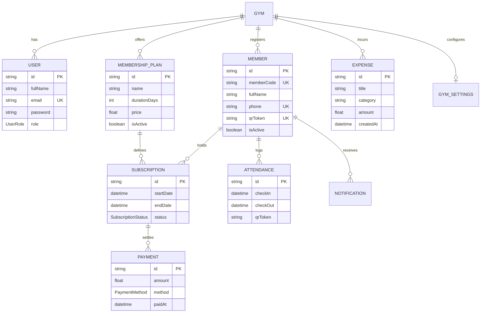

<div align="center">

# 🏋️‍♂️ POWER GYM MANAGEMENT SYSTEM

### A Modern, Full-Stack Gym Management Platform

[](https://power-gym-khashana.vercel.app)
[](https://backend-zeta-sage-77.vercel.app/health/db)
[](LICENSE)

<br/>

[](https://nextjs.org/)
[](https://nestjs.com/)
[](https://www.typescriptlang.org/)
[](https://tailwindcss.com/)
[](https://www.prisma.io/)
[](https://neon.tech/)
[](https://developers.facebook.com/docs/whatsapp/cloud-api)
[](https://power-gym-khashana.vercel.app)

<p align="center">
  <b>A complete cloud-based gym management solution: member registration, smart QR attendance, subscription tracking, multi-gateway payments in Egyptian Pounds (EGP), expense monitoring, financial analytics, and automated WhatsApp notifications.</b>
</p>

[🌐 Live Demo](https://power-gym-khashana.vercel.app) • [⚡ Features](#-key-features) • [🏛️ Architecture](#-system-architecture) • [🚀 Getting Started](#-getting-started) • [📡 API Reference](#-api-reference) • [👨‍💻 Credits](#-credits)

</div>

---

## 🌟 Quick Access & Demo Credentials

Try the full system live right now:

| Property | Value |
| :--- | :--- |
| 🌐 **Primary Live URL** | [https://power-gym-khashana.vercel.app](https://power-gym-khashana.vercel.app) |
| 🌐 **Alternative Domain** | [https://powergymkhashana.vercel.app](https://powergymkhashana.vercel.app) |
| 📧 **Demo Email** | `admin@powergym.com` |
| 🔑 **Password** | `Admin@2026` |
| 👤 **Gym Owner** | **Mohamed Mousa** |
| 🛡️ **Role** | OWNER (Full System Access) |
| 💱 **Currency** | Egyptian Pound (**EGP** - ج.م) |

---

## ⚡ Key Features

### 1. 📱 Smart QR Code Check-in System
- Instant QR code scanning via camera or wireless barcode scanner.
- Smart manual input with live search shortcuts.
- Automatic real-time subscription validation (Active / Expired / Frozen).
- Color-coded and sound alerts at reception (Green: success, Red: expired, Blue: already checked in today).
- Live daily attendance counter with precise check-in timestamps.

### 2. 👥 Member Management & Profiles
- Fast member registration with automatic validation of Egyptian mobile numbers (`01x` format).
- Auto-generated unique member code (e.g. `PG-1001`) and personalized QR code for every member.
- One-click membership card printing and downloading.
- Comprehensive profile card: contact info, join date, attendance statistics (total, this month, this year, last visit), and full subscription history.

### 3. 💳 Subscriptions & Membership Plans
- Flexible membership plan configuration: daily, monthly, 3-month, 6-month, or annual — with EGP pricing.
- Automatic remaining-days calculation with visual yellow/red alerts as expiry approaches.
- One-click subscription renewal with payment method and amount auto-filled.

### 4. 💵 Multi-Gateway Payment Collection
- Full support for Egypt's most popular payment methods:
  - 💵 **Cash**
  - 💳 **Visa / Bank Cards**
  - ⚡ **InstaPay**
  - 📱 **Vodafone Cash & Mobile Wallets**
- Every payment linked to a member's subscription ID with date and timestamp.

### 5. 📉 Operational Expense Tracking
- Precise tracking of all gym running costs:
  - Monthly rent, utility bills (electricity, water, gas), trainer/staff salaries, equipment purchases & upgrades, maintenance, marketing & ads, and cleaning supplies.
- Visual breakdown bar showing expense distribution by category and percentage of monthly total.
- Flexible monthly filters to review and audit expenses from any past month.

### 6. 📊 Interactive Financial Analytics & Reports
- Interactive charts powered by **Recharts** displaying daily revenue trends and average daily income.
- Income breakdown by payment method (Cash, Visa, InstaPay, Vodafone Cash).
- Charts tracking daily attendance rates and new member registrations.
- Instant export to **PDF** and **Excel**.

### 7. 💬 WhatsApp Automation (Meta Cloud API)
- Auto welcome messages on new subscription with full membership details.
- Automated reminders before subscription expiry (7 days before, and on the expiry day).
- Instant renewal confirmation and payment receipt notification.
- Full notification log showing message delivery status (Sent / Pending / Failed).

### 8. 🌐 100% Arabic Native Interface (RTL Dark Theme)
- Sleek, eye-friendly dark theme using a professional color palette (`#09090B`, `#18181B`, `#F97316`).
- Native Right-to-Left (RTL) layout with the elegant **Cairo** Arabic typeface.

---

## 🏛️ System Architecture



---

## 🗄️ Database Schema (Entity-Relationship Diagram)



---

## 💻 Tech Stack

| Layer | Technology | Description |
| :--- | :--- | :--- |
| **Frontend Framework** | [Next.js 16](https://nextjs.org/) (App Router) | Latest Next.js with Turbopack & Server Components architecture |
| **Language** | [TypeScript 5](https://www.typescriptlang.org/) | Fully typed codebase with strict DTOs and interfaces |
| **Styling** | [Tailwind CSS v4](https://tailwindcss.com/) | Modern dark responsive design with native RTL support |
| **Typography** | [Google Fonts Cairo](https://fonts.google.com/specimen/Cairo) | Professional Arabic font designed for digital applications |
| **UI Icons** | [Lucide React](https://lucide.dev/) | Consistent, professional icon set for all operations |
| **Charts** | [Recharts](https://recharts.org/) | Interactive charts for revenue tracking and daily growth |
| **Backend Framework** | [NestJS 10](https://nestjs.com/) | Enterprise-grade framework with Modules & Dependency Injection |
| **ORM** | [Prisma ORM](https://www.prisma.io/) | Type-safe database modeling and high-performance queries |
| **Database** | [Neon PostgreSQL](https://neon.tech/) | Serverless cloud PostgreSQL database with high availability |
| **Authentication** | JWT & HttpOnly Cookies | Secure encryption and auth with role-based access control (RBAC) |
| **Cloud Hosting** | [Vercel](https://vercel.com/) | Instant serverless deployment for both frontend and backend with Edge CDN |
| **Messaging API** | [Meta WhatsApp Cloud API](https://developers.facebook.com/) | Official WhatsApp automated messaging and notifications |

---

## 📁 Project Directory Structure

```text
power-gym/
├── .github/                      # GitHub community & workflow configuration
│   ├── workflows/ci.yml          # Automated CI — build & health check on every push
│   ├── ISSUE_TEMPLATE/           # Bug report and feature request templates
│   └── PULL_REQUEST_TEMPLATE.md  # Pull request review template
├── backend/                      # REST API server & data management (NestJS)
│   ├── prisma/
│   │   ├── schema.prisma         # Database schema definition
│   │   └── migrations/           # Migration history and changelogs
│   └── src/
│       ├── auth/                 # Login system and JWT token generation
│       ├── members/              # Member management and QR codes
│       ├── membership-plans/     # Subscription plans and pricing
│       ├── subscriptions/        # Subscription tracking and renewals
│       ├── attendance/           # Check-in and QR scanning
│       ├── payments/             # Payment receipts and records
│       ├── expenses/             # Expense registration and categorization
│       ├── dashboard/            # Control panel statistics
│       ├── reports/              # Revenue and activity report generator
│       └── notifications/        # WhatsApp Cloud API integration
├── frontend/                     # User interface and experience (Next.js 16)
│   ├── app/
│   │   ├── (dashboard)/          # Main dashboard pages
│   │   ├── attendance/           # Smart QR attendance scanner
│   │   ├── members/              # Member view, register, and edit screens
│   │   ├── subscriptions/        # Subscription table and plan renewals
│   │   ├── plans/                # EGP pricing plan cards
│   │   ├── payments/             # Payment collection screen
│   │   ├── expenses/             # Monthly expense management screen
│   │   ├── reports/              # Reports and interactive charts
│   │   ├── calendar/             # Interactive monthly calendar
│   │   ├── notifications/        # WhatsApp message log
│   │   ├── settings/             # Gym and owner settings
│   │   └── components/           # Reusable design components
├── docker-compose.yml            # Container setup for local development
├── CONTRIBUTING.md               # Contribution and development guidelines
├── SECURITY.md                   # Security policy and vulnerability reporting
└── LICENSE                       # MIT License
```

---

## 🚀 Getting Started

### Prerequisites
- **Node.js** v20 or v22 LTS installed
- **Git** installed
- **PostgreSQL** database — local or cloud via [Neon](https://neon.tech/)

### 1. Clone the Repository
```bash
git clone https://github.com/Khashana22/power-gym.git
cd power-gym
```

### 2. Setup & Run the Backend
```bash
cd backend
npm install

# Configure environment variables
cp .env.example .env
# Set DATABASE_URL and JWT_SECRET in your .env file

# Apply migrations and generate Prisma client
npx prisma migrate deploy
npx prisma generate

# Start the development server
npm run start:dev
```
Backend will run at: `http://localhost:3001`

### 3. Setup & Run the Frontend
```bash
cd ../frontend
npm install

# Start the web interface
npm run dev
```
Frontend will run at: `http://localhost:3000`

---

## 📡 API Reference

| Module | Method | Endpoint | Description |
| :--- | :---: | :--- | :--- |
| **Auth** | `POST` | `/auth/login` | Login and generate JWT token |
| **Auth** | `GET` | `/auth/me` | Retrieve current user data |
| **Members** | `GET` | `/members` | List all registered members |
| **Members** | `POST` | `/members` | Add a new member with QR Token |
| **Members** | `GET` | `/members/:id` | Get a member's full profile |
| **Members** | `PATCH` | `/members/:id` | Update member information |
| **Members** | `DELETE` | `/members/:id` | Soft-delete a member |
| **Attendance** | `POST` | `/attendance/checkin` | Log member check-in via QR |
| **Subscriptions** | `GET` | `/subscriptions/member/:id` | Get member's subscriptions |
| **Subscriptions** | `POST` | `/subscriptions` | Create and activate a new subscription |
| **Payments** | `POST` | `/payments` | Record a payment (Cash, Visa, InstaPay, Vodafone Cash) |
| **Expenses** | `GET` | `/expenses?month=YYYY-MM` | Get expenses for a specific month |
| **Expenses** | `POST` | `/expenses` | Log a new operational expense |
| **Reports** | `GET` | `/reports/revenue` | Revenue and daily payment report |
| **Reports** | `GET` | `/reports/attendance` | Attendance and visitor statistics |

---

## 👨‍💻 Credits

<div align="center">

| Gym Owner | Lead Developer |
| :---: | :---: |
| **Mohamed Mousa** | **Sayed Khashana** |
| Owner of POWER GYM | Software Engineer & System Architect |
| Gym Operations & Management | 📞 Phone / WhatsApp: `01559666564` |
| — | 🐙 GitHub: [@Khashana22](https://github.com/Khashana22) |

</div>

---

<div align="center">
  <sub>POWER GYM Professional Management System. All Rights Reserved &copy; 2026</sub>
</div>
