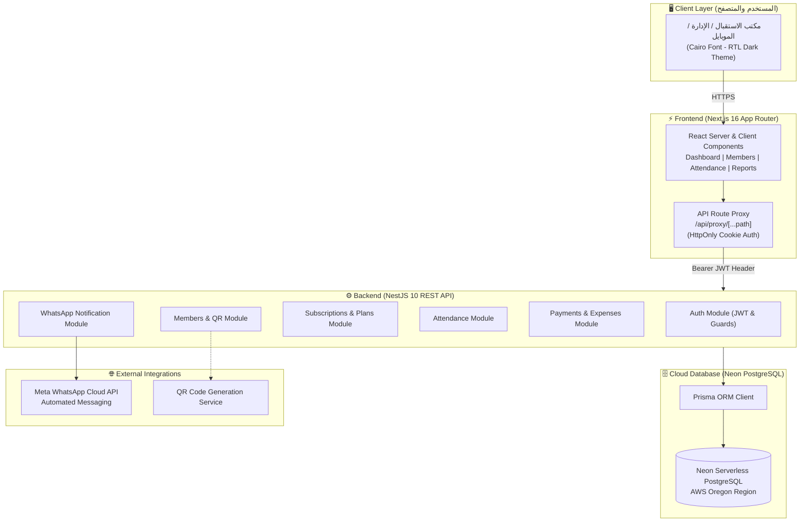
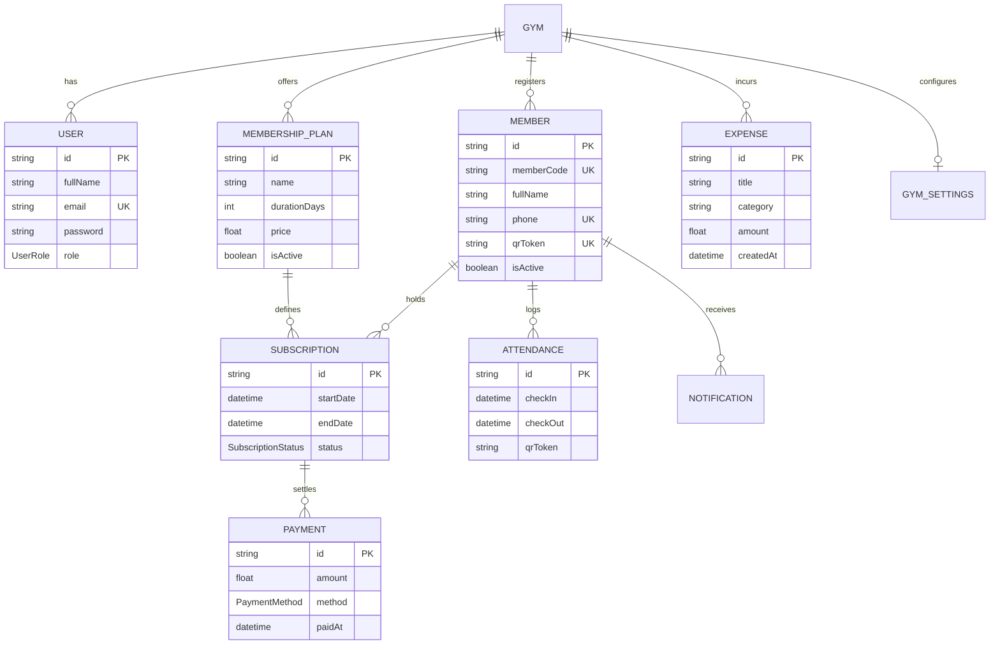

<div align="center">

# 🏋️‍♂️ POWER GYM MANAGEMENT SYSTEM
### نظام إدارة الصالات الرياضية والاشتراكات المتكامل والحديث

[](https://power-gym-khashana.vercel.app)
[](https://backend-zeta-sage-77.vercel.app/health/db)
[](LICENSE)

<br/>

[](https://nextjs.org/)
[](https://nestjs.com/)
[](https://www.typescriptlang.org/)
[](https://tailwindcss.com/)
[](https://www.prisma.io/)
[](https://neon.tech/)
[](https://developers.facebook.com/docs/whatsapp/cloud-api)
[](https://power-gym-khashana.vercel.app)

<p align="center">
  <b>منظومة سحابية متكاملة واحترافية لإدارة الجيم: تسجيل الأعضاء، الحضور الذكي برمز QR، تتبع الاشتراكات، تحصيل المدفوعات بالجنيه المصري (ج.م)، رصد المصروفات التشغيلية، التقارير المالية التفاعلية، وإرسال تنبيهات واتساب الآلية.</b>
</p>

[🌐 تجربة النظام مباشرة (Live Demo)](https://power-gym-khashana.vercel.app) • [📖 المميزات](#-المميزات-الرئيسية--key-features) • [🏛️ هيكلية النظام](#-هيكلية-النظام--system-architecture) • [🚀 التشغيل المحلي](#-التشغيل-والتثبيت-المحلي--getting-started) • [👨‍💻 المطور والمالك](#-فريق-العمل-والمالك--credits)

</div>

---

## 🌟 الوصول السريع وبيانات الدخول التجريبية (Quick Access)

يمكنك تجربة النظام كاملاً الآن مباشرة عبر الرابط السحابي:

| الخاصية | القيمة |
| :--- | :--- |
| 🌐 **رابط المنظومة المباشر** | [https://power-gym-khashana.vercel.app](https://power-gym-khashana.vercel.app) |
| 🌐 **دومين بديل** | [https://powergymkhashana.vercel.app](https://powergymkhashana.vercel.app) |
| 📧 **البريد الإلكتروني التجريبي** | `admin@powergym.com` |
| 🔑 **كلمة المرور** | `Admin@2026` |
| 👤 **اسم المالك** | **محمد موسى** |
| 🛡️ **الصلاحية** | OWNER (مالك ومدير النظام) |
| 💱 **العملة المعتمدة** | الجنيه المصري (**ج.م** - EGP) |

---

## ⚡ المميزات الرئيسية (Key Features)

### 1. 📱 نظام تسجيل الحضور الذكي السريع (QR Code Check-in)
- مسح سريع ومباشر لأكواد QR الخاصة بالأعضاء عبر الكاميرا أو القارئ الضوئي اللاسلكي.
- إدخال يدوي ذكي يدعم اختصارات البحث الفوري.
- تحقق فوري وآلي من صلاحية الاشتراك (نشط / منتهي / مجمّد).
- تنبيهات ملونة وصوتية واضحة للاستقبال (أخضر: دخول ناجح، أحمر: اشتراك منتهي، أزرق: تم التسجيل اليوم مسبقاً).
- عدّاد لحظي لحضور اليوم مع سجل زمني دقيق لوقت الدخول.

### 2. 👥 إدارة الأعضاء والملفات الشخصية (Member Management)
- تسجيل سريع للأعضاء الجدد مع التحقق التلقائي من صحة أرقام الهواتف المصرية (`01x`).
- توليد تلقائي لكود العضوية الفريد (مثال: `PG-1001`) ورمز QR المخصص لكل لاعب.
- إمكانية طباعة أو تنزيل بطاقة العضوية بضغطة زر واحدة.
- بطاقة ملف شخصي شاملة: بيانات الاتصال، تاريخ الانضمام، إحصائيات الحضور (الإجمالي، هذا الشهر، هذا العام، وآخر زيارة)، وسجل الاشتراكات.

### 3. 💳 إدارة الاشتراكات والخطط (Subscriptions & Membership Plans)
- تخصيص خطط العضوية المتعددة: يومي، شهري، 3 شهور، 6 شهور، أو سنوي مع تحديد الأسعار بالجنيه المصري.
- متابعة مدة الاشتراكات مع حساب تلقائي للأيام المتبقية وتنبيهات بصرية باللون الأصفر والأحمر عند اقتراب الانتهاء.
- تجديد الاشتراك بضغطة زر واحدة مع تحديد طريقة الدفع والمبلغ المستلم تلقائياً.

### 4. 💵 تسجيل وتحصيل المدفوعات (Multi-Gateway Payments)
- دعم كامل لأشهر طرق الدفع في السوق المصري:
  - 💵 **كاش (نقدي)**
  - 💳 **فيزا وبطاقات بنكية**
  - ⚡ **إنستاباي (InstaPay)**
  - 📱 **فودافون كاش ومحافظ المحمول (Vodafone Cash)**
- ربط كل عملية دفع برقم اشتراك العضو مع تاريخ وساعة الدفع.

### 5. 📉 رصد وإدارة المصروفات التشغيلية (Expense Tracking)
- تتبع دقيق لكافة تكاليف وتشغيل الصالة الرياضية:
  - الإيجار الشهري، فواتير المرافق (كهرباء، مياه، غاز)، رواتب المدربين والعمال، شراء وتحديث الأجهزة، الصيانة الدورية، التسويق والإعلانات، ومستلزمات النظافة.
- شريط مرئي يوضح توزيع المصاريف حسب الفئة ونسبتها المئوية من إجمالي الشهر.
- فلاتر شهرية مرنة لعرض ومراجعة نفقات أي شهر سابق.

### 6. 📊 لوحة تقارير وإحصائيات مالية تفاعلية (Analytics & Reports)
- رسوم بيانية تفاعلية باستخدام **Recharts** تعرض اتجاه الإيرادات اليومية ومتوسط الدخل اليومي.
- تحليل نسب الدخل حسب وسيلة الدفع (كاش، فيزا، إنستاباي، فودافون كاش).
- رسوم بيانية ترصد معدلات الحضور اليومية والأعضاء الجدد.
- تصدير فوري للتقارير بصيغة **PDF** و **Excel**.

### 7. 💬 تكامل واتساب للرسائل الآلية (Meta WhatsApp Cloud API)
- نظام آلي لإرسال رسائل الترحيب عند الاشتراك الجديد مع بيانات العضوية.
- تذكيرات آلية قبل انتهاء الاشتراك (قبل 7 أيام، ويوم الانتهاء).
- إشعار فوري عند تجديد الاشتراك وتأكيد استلام الدفعة.
- سجل إشعارات كامل يوضح حالة الرسالة (تم الإرسال / قيد الانتظار / فشلت).

### 8. 🌐 واجهة عربية كاملة 100% (Arabic Native & Modern Dark RTL)
- تصميم داكن فخم ومريح للعين يعتمد على لوحة ألوان احترافية (`#09090B`, `#18181B`, `#F97316`).
- دعم أصيل للاتجاه من اليمين لليسار (RTL) مع خط **Cairo** المتميز.

---

## 🏛️ هيكلية النظام (System Architecture)



---

## 🗄️ مخطط قاعدة البيانات (Entity-Relationship Diagram)



---

## 💻 حزمة التقنيات المستخدمة (Tech Stack)

| الطبقة (Layer) | التقنية (Technology) | الوصف والدور |
| :--- | :--- | :--- |
| **Frontend Framework** | [Next.js 16](https://nextjs.org/) (App Router) | أحدث إصدارات Next.js مع معمارية Turbopack و Server Components |
| **Language** | [TypeScript 5](https://www.typescriptlang.org/) | نمط كتابة كود عالي الأمان مع Typed DTOs و Interfaces كاملة |
| **Styling** | [Tailwind CSS v4](https://tailwindcss.com/) | تصميم عصري داكن سريع الاستجابة ويدعم RTL |
| **Typography** | [Google Fonts Cairo](https://fonts.google.com/specimen/Cairo) | خط عربي رسمي وأنيق مصمم خصيصاً للتطبيقات العربية |
| **UI Components & Icons** | [Lucide React](https://lucide.dev/) | أيقونات متناسقة واحترافية لكافة العمليات |
| **Charts** | [Recharts](https://recharts.org/) | رسوم بيانية تفاعلية لمتابعة الإيرادات والنمو اليومي |
| **Backend Framework** | [NestJS 10](https://nestjs.com/) | إطار عمل مؤسسي قوي بنظام الـ Modules و Dependency Injection |
| **ORM** | [Prisma ORM](https://www.prisma.io/) | نمذجة الجداول واستعلامات قاعدة البيانات فائقة السرعة |
| **Database** | [Neon PostgreSQL](https://neon.tech/) | قاعدة بيانات سحابية Serverless عالية الأداء |
| **Authentication** | JWT & HttpOnly Cookies | نظام تشفير وتوثيق آمن مع عزل الصلاحيات (RBAC) |
| **Cloud Hosting** | [Vercel](https://vercel.com/) | نشر سحابي فوري للواجهة والسيرفر مع تفعيل الـ Edge CDN |
| **Messaging API** | [Meta WhatsApp Cloud API](https://developers.facebook.com/) | إرسال رسائل وتنبيهات واتساب الرسمية |

---

## 📁 هيكل مجلدات المشروع (Directory Structure)

```text
power-gym/
├── .github/                      # إعدادات مجتمع GitHub ومسارات العمل
│   ├── workflows/ci.yml          # مسار الفحص والبناء الآلي المستمر (CI)
│   ├── ISSUE_TEMPLATE/           # نماذج الإبلاغ عن الأخطاء وطلب الميزات
│   └── PULL_REQUEST_TEMPLATE.md  # نموذج طلبات السحب والمراجعة
├── backend/                      # سيرفر الـ API ونظام إدارة البيانات (NestJS)
│   ├── prisma/
│   │   ├── schema.prisma         # مخطط قاعدة البيانات (Prisma Schema)
│   │   └── migrations/           # سجل التحديثات والـ Migrations
│   └── src/
│       ├── auth/                 # نظام تسجيل الدخول وتوليد التوكن
│       ├── members/              # إدارة الأعضاء وأكواد الـ QR
│       ├── membership-plans/     # خطط الاشتراك والأسعار
│       ├── subscriptions/        # تتبع الاشتراكات وتجديدها
│       ├── attendance/           # فحص الدخول والباركود
│       ├── payments/             # سندات القبض والمدفوعات
│       ├── expenses/             # تسجيل وتصنيف المصروفات
│       ├── dashboard/            # إحصائيات لوحة التحكم
│       ├── reports/              # مولد تقارير الإيرادات والنشاط
│       └── notifications/        # تكامل رسائل واتساب السحابية
├── frontend/                     # واجهة المستخدم وتجربة الاستخدام (Next.js 16)
│   ├── app/
│   │   ├── (dashboard)/          # صفحات لوحة التحكم الرئيسية
│   │   ├── attendance/           # ماسح الحضور السريع الذكي
│   │   ├── members/              # شاشات عرض وتسجيل وتعديل الأعضاء
│   │   ├── subscriptions/        # جدول الاشتراكات وتجديد الباقات
│   │   ├── plans/                # بطاقات خطط الأسعار بالج.م
│   │   ├── payments/             # شاشة تحصيل المدفوعات
│   │   ├── expenses/             # شاشة إدارة المصروفات الشهرية
│   │   ├── reports/              # التقارير والرسوم البيانية
│   │   ├── calendar/             # التقويم الشهري التفاعلي
│   │   ├── notifications/        # سجل رسائل واتساب
│   │   ├── settings/             # إعدادات الجيم والمالك
│   │   └── components/           # عناصر التصميم القابلة لإعادة الاستخدام
├── docker-compose.yml            # إعداد الحاويات والتشغيل المحلي
├── CONTRIBUTING.md               # إرشادات المساهمة والتطوير
├── SECURITY.md                   # سياسة الأمان والإبلاغ عن الثغرات
└── LICENSE                       # رخصة الاستخدام (MIT License)
```

---

## 🚀 التشغيل والتثبيت المحلي (Getting Started)

### المتطلبات الأساسية (Prerequisites):
- تثبيت **Node.js** (الإصدار 20 أو 22 LTS).
- تثبيت **Git**.
- قاعدة بيانات **PostgreSQL** محلياً أو سحابياً عبر Neon.

### 1. استنساخ المستودع (Clone Repository):
```bash
git clone https://github.com/Khashana22/power-gym.git
cd power-gym
```

### 2. إعداد وتشغيل السيرفر (Backend):
```bash
cd backend
npm install

# إعداد ملف البيئة
cp .env.example .env
# تأكد من وضع رابط قاعدة البيانات DATABASE_URL و JWT_SECRET في ملف .env

# تطبيق الـ Migrations وتوليد عميل Prisma
npx prisma migrate deploy
npx prisma generate

# تشغيل السيرفر في وضع التطوير
npm run start:dev
```
السيرفر سيعمل على: `http://localhost:3001`

### 3. إعداد وتشغيل الواجهة (Frontend):
```bash
cd ../frontend
npm install

# تشغيل واجهة الويب
npm run dev
```
الموقع سيعمل على: `http://localhost:3000`

---

## 📡 نظرة سريعة على الـ REST API (Endpoints)

| الوحدة | الطريقة (Method) | المسار (Endpoint) | الوظيفة |
| :--- | :---: | :--- | :--- |
| **Auth** | `POST` | `/auth/login` | تسجيل الدخول وتوليد رمز JWT |
| **Auth** | `GET` | `/auth/me` | استرجاع بيانات المستخدم الحالي |
| **Members** | `GET` | `/members` | عرض قائمة الأعضاء المسجلين |
| **Members** | `POST` | `/members` | إضافة عضو جديد مع توليد QR Token |
| **Members** | `GET` | `/members/:id` | عرض الملف الشخصي الكامل للعضو |
| **Attendance** | `POST` | `/attendance/checkin` | تسجيل حضور العضو عبر الـ QR |
| **Subscriptions**| `GET` | `/subscriptions/member/:id` | عرض اشتراكات العضو |
| **Subscriptions**| `POST` | `/subscriptions` | إنشاء وتفعيل اشتراك جديد |
| **Payments** | `POST` | `/payments` | تسجيل دفعة مالية (كاش، فيزا، إنستاباي، فودافون كاش) |
| **Expenses** | `GET` | `/expenses?month=YYYY-MM` | عرض مصروفات الشهر المحدد |
| **Expenses** | `POST` | `/expenses` | تسجيل مصروف تشغيلي جديد |
| **Reports** | `GET` | `/reports/revenue` | تقرير الإيرادات والمدفوعات اليومية |
| **Reports** | `GET` | `/reports/attendance` | إحصائيات الحضور والرواد |

---

## 👨‍💻 فريق العمل والمالك (Credits & Attribution)

<div align="center">

| المالك (Gym Owner) | المطور الرئيسي (Lead Developer) |
| :---: | :---: |
| **محمد موسى** | **Sayed Khashana** |
| مالك صالة POWER GYM الرياضية | مهندس برمجيات ومطور ومصمم النظام |
| إدارة الصالة والعمليات التشغيلية | 📞 هاتف / واتساب: `01559666564` |
| — | 🐙 GitHub: [@Khashana22](https://github.com/Khashana22) |

</div>

---

<div align="center">
  <sub>نظام إدارة الصالات الرياضية الاحترافي POWER GYM. جميع الحقوق محفوظة &copy; 2026</sub>
</div>
